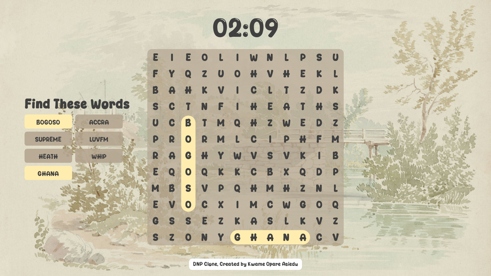

# GameKit Word Puzzle

This is a clone of the word puzzle at https://dailynewspuzzle.com, built using the [GameKit](https://gamekit.opare.dev)
engine.

## Requirements

To set this project up locally, you need to have the following installed on your computer:

- Java JDK (18 or above)
- Maven (3.9.11 or above)

## Setup

- Clone this project
- Run `mvn clean compile` to compile the project. This will download the needed dependencies
- Run the `main` method in the `Launcher` class (`src/main/java/dev/gamekit/wordpuzzle/Launcher.java`) to start the
  application.